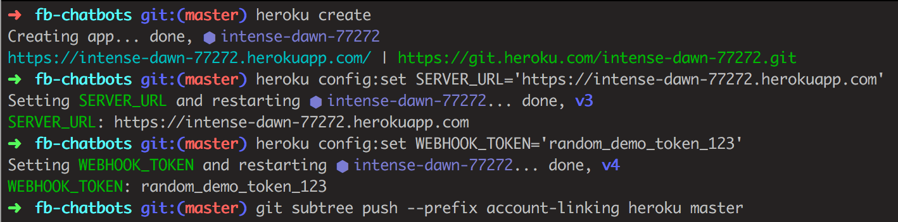
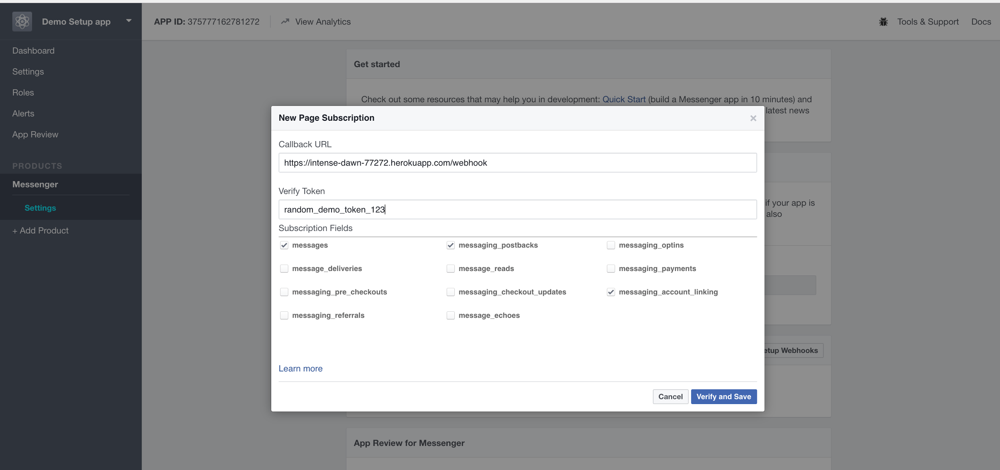
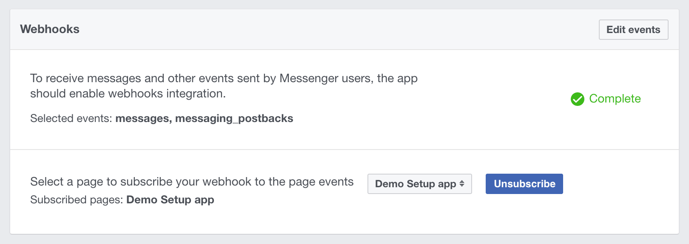
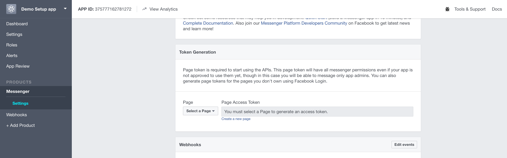

# Account Linking Demo - Jasper’s Market

This is the folder for Jasper’s Market, a bot that demonstrates [Account Linking](https://developers.facebook.com/docs/messenger-platform/design-best-practices/guides/account-linking/) functionality for the Messenger Platform.

**[](https://m.me/JaspersMarket)**

## Everything we used to make this Bot

### Technologies used

#### ECMAScript 7 (“ES7” / JavaScript)
ECMAScript™ is the standard behind JavaScript. It has had a number of very useful additions over the past several years, modernizing the syntax and providing new capabilities.

*[Learn More](https://developer.mozilla.org/en-US/docs/Web/JavaScript/New_in_JavaScript/ECMAScript_Next_support_in_Mozilla)*

#### Babel
Not all browsers are able to run ES7. We use Babel to generate earlier versions of JavaScript from ES7, so that it will run on browsers that haven’t yet implemented the newer standard.

*[Learn More](https://babeljs.io/)*

#### Node.js
Node enables us to use JavaScript outside of a browser and directly on our machines to perform the logic necessary to determine what messages to send to the end user and when.

*[Learn More](https://nodejs.org/en/docs/)*

#### Express.js
Express is a helpful framework built around Node.js for performing actions as a web server. e.g, Taking web page requests, responding and serving images to users.

*[Learn More](http://expressjs.com/)*

#### Pug/Jade Templates
Pug/Jade (same project but has recently changed names) is a very simple templating language. This helps us create HTML for the pages we show in a programmatic way. For example we can show an error message only when an error has occurred.

*[Learn More](https://pugjs.org/api/getting-started.html)*

#### WeUI
You can get started quickly with mobile-friendly web UI by using a library of components like the one from [WeUI](https://weui.io/).


## Setup
It’s quick and easy to run this yourself on Heroku!

*Note: It is not recommended to run this bot locally on your machine. It will require extra configuration to make your local machine accessible by external Internet services. Without the extra configuration, Facebook Messenger will not be able to reach your bot.*

#### 0. Prepare Prerequisites
* Node v7.4 or later ([https://nodejs.org/en/download/](https://nodejs.org/en/download/))
* Yarn ([https://yarnpkg.com/en/](https://yarnpkg.com/en/))
* Heroku CLI ([https://devcenter.heroku.com/articles/heroku-cli](https://devcenter.heroku.com/articles/heroku-cli))
* Facebook developer account ([https://developers.facebook.com](https://developers.facebook.com) )

#### 1. Set Up your Bot on Heroku

##### Run the following
```bash
$ cd /path/to/fb-chatbots

$ heroku create

# URL_TO_HEROKU_APP is the url given to you from the above command
$ heroku config:set SERVER_URL='https://{URL_TO_HEROKU_APP}'

# Note the token can be any word chosen by you and is used to by Facebook to check that they have the correct server for your Messenger Bot
$ heroku config:set WEBHOOK_TOKEN='random_demo_token_123'

# This pushes just the account-linking folder to Heroku
$ git subtree push --prefix account-linking heroku master
```

##### It should look like this in your terminal


##### Other useful commands for pushing the code to Heroku
To force push to Heroku, useful for moving your changes from your machine to Heroku, use this command:
* `git push --force heroku 'git subtree split --prefix account-linking HEAD':master`

#### 2. Setup your Bot on Facebook

##### I. Create a Facebook App


1. Navigate here [https://developers.facebook.com/apps](https://developers.facebook.com/apps)
2. Add a new app with the category `Apps for Messenger`

##### II. Setup Webhooks
*These are the actions we want to sign up to receive from users talking to us in Messenger.*


1. Go to the Messenger settings for your app and select `Setup Webhook`
2. Insert `https://{your_heroku_app_url}/webhook` into the `Callback URL` field
3. Insert the value you used for `WEBHOOK_TOKEN` into the `Verify Token` field
4. Select the Subscription Fields
    1. `messages`
    2. `messaging_account_linking`
    3. `messaging_postbacks`
5. Select `Verify and Save`
6. Select the Facebook Page that should subscribe to the Webhooks in the `Webhooks` section of Messenger Settings



##### III. Get a Page Access Token


1. In the Messaging section of the App settings page (_not_ the Page settings), select or Create a page and get the page access token
3. Go back to your terminal and inside the repository set the `PAGE_ACCESS_TOKEN` config on Heroku.

```bash
$ heroku config:set PAGE_ACCESS_TOKEN='your_page_access_token'
```

#### 3. Now you should be able to go to your page and message your bot!

*Note: you will need to add testers in the development panel or have the app approved by facebook for others to see it.*

### Running locally
You may want to run this bot on a platform outside of Heroku or simply have it available locally for testing purposes.
```bash
$ cd path/to/repo/account-linking
$ yarn install
$ yarn dev
```

### Running tests
```bash
$ cd path/to/repo/account-linking
$ yarn quality
```
